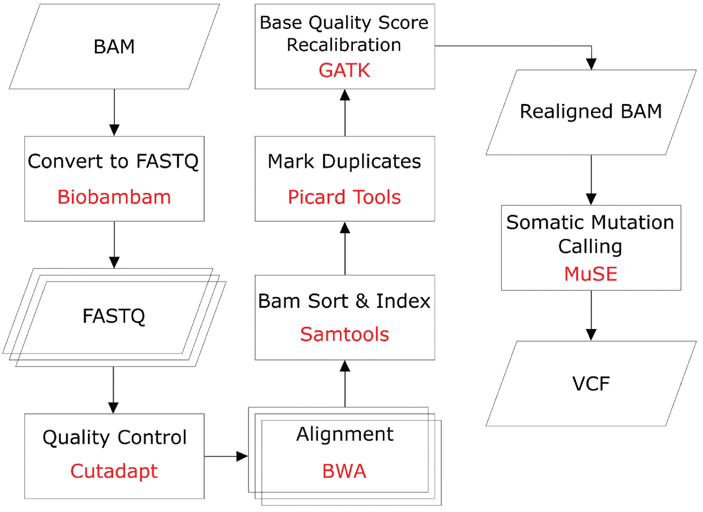

# MuSE

An accurate and ultra-fast somatic mutation calling tool for whole-genome sequencing (WGS) and whole-exome sequencing (WES) data from heterogeneous tumor samples. This tool is unique in accounting for tumor heterogeneity using a sample-specific error model improves sensitivity and specificity in mutation calling from sequencing data.

## Introduction

The detection of somatic point mutations is a key component of cancer genomic research, which has been rapidly developing since next-generation sequencing (NGS) technology revealed its potential for describing genetic alterations in cancer. We previously launched MuSE 1.0<sup>1</sup>, a statistical approach for mutation calling based on a Markov substitution model for molecular evolution. It has been used as a major contributing caller in a consensus calling strategy by the TCGA PanCanAtlas project<sup>2</sup> and the ICGC Pan-Cancer Analysis of Whole Genomes (PCAWG) initiative<sup>3</sup>.

We have now released MuSE 2.0, which is powered by parallel computing by taking advantage of multi-core resource on a machine, and a more efficient way of memory allocation. MuSE 2.0 takes the same input files and outputs the same results as MuSE 1.0. It achieves 40-50x speedup compared to MuSE 1.0. For example, MuSE 1.0 takes 2-4 hours to run on one pair of tumor-normal WES data, and ∼40 hours on one pair of tumor-normal WGS data. MuSE 2.0 can complete the running one pair of tumor-normal WES data in 5-7 minutes and one pair of tumor-normal WGS data in about one hour, thus removing somatic mutation calling as a time-consuming obstacle for cancer genomic studies.

## Platform
1.	MuSE 1.0 supports both Linux system and MacOS.
2.	MuSE 2.0 only supports Linux system with `gcc=7.0` and `git=2.0` or above.

## Installation
```
git clone https://github.com/wwylab/MuSE.git
cd MuSE
./install_muse.sh
```
The executable file `MuSE` will be generated in the same directory.
## Pre-processing
Before running MuSE, raw WES/WGS data need to be processed with the following software, as outlined in the following flowchart. Please refer to GDC best practice guidelines (https://docs.gdc.cancer.gov/Data/Bioinformatics_Pipelines/DNA_Seq_Variant_Calling_Pipeline/) for a detailed description about the pre-processing pipeline.



1. `Biobambam` (https://github.com/gt1/biobambam) to convert to FASTQ if the input is a binary sequence alignment map (BAM) file
2. `cutadapt` (https://cutadapt.readthedocs.io/en/stable/) for adapter and low-quality bases trimming
3. `bwa` (http://bio-bwa.sourceforge.net/) for alignment against the reference genome
4. `samtools` (http://www.htslib.org/) to sort and index BAM files
5. `picard` (https://broadinstitute.github.io/picard/) to mark duplicates
6. `GATK 3.7` (https://github.com/broadgsa/gatk) for base quality score recalibration

## Input data
Same as MuSE 1.0, MuSE 2.0 requires the following files as input:

1. Indexed reference genome FASTA file.
2. BAM formatted sequence data from the pair of tumor and normal DNA samples that have gone through the pre-processing step.
3. dbSNP variant call format (VCF) file that should be bgzip compressed, tabix indexed, and based on the same reference genome.

## Running MuSE
MuSE runs in two steps. The first step, `MuSE call`, takes as Files (1) and (2). This step carries out pre-filtering and calculating position-specific summary statistics using the Markov substitution model.

```
Usage:   MuSE call [options] tumor.bam matched_normal.bam
Options:
         -f FILE    faidx indexed reference genome file
         -O STR     output file name (suffix '.MuSE.txt' is
                    automatically added)
         -n INT     number of cores specified (default=1)

Example: 
MuSE call -f Reference.Genome -O Output.Prefix -n 20 Tumor.bam Matched.Normal.bam
```

The second step, `MuSE sump`, takes as input the output file from `MuSE call` and File (3). This step computes tier-based cutoffs from a sample-specific error model. We provide two options for building the model, one for WES data (option `-E`), and the other for WGS data (option `-G`).

```
Usage:   MuSE sump [options]
Options:
         -I FILE    single input file generated by 'MuSE call'
         -G         input generated from whole genome sequencing data
         -E         input generated from whole exome sequencing data
         -O STR     output file name (VCF format)
         -D FILE    dbSNP vcf file that should be bgzip compressed,
                    tabix indexed and based on the same reference
                    genome used in 'MuSE call'

Example:
MuSE sump -I Output.Prefix.MuSE.txt -G -O Output.Prefix.vcf -D dbsnp.vcf.gz
```

## Output of MuSE
The final output of MuSE is a VCF file (v4.1) that lists the identified somatic variants along with tiered rankings (in the `FILTER` field) for these mutations. The rankings range from `PASS` which is the highest confidence category, followed by `Tiers 1-5`, with `Tier 5` being the tier at the lowest confidence. The INFO field of the VCF file is always `SOMATIC`.

## Acknowledgement
We thank Mehrzad Samadi and his team from Nvidia Corporation, including Tong Zhu, Timothy Harkins and Ankit Sethia, for their contributions of implementing accelerating techniques in the ` MuSE call` step.

## Reference
```
1.  Fan, Y. et al. (2016) ‘MuSE: accounting for tumor heterogeneity using a sample-specific error model improves sensitivity and specificity in mutation calling from sequencing data’, Genome biology, 17(1), p. 178. doi: 10.1186/s13059-016-1029-6.

2.  Ellrott, K. et al. (2018) ‘Scalable Open Science Approach for Mutation Calling of Tumor Exomes Using Multiple Genomic Pipelines’, Cell Systems. Cell Press, 6(3), pp. 271-281.e7. doi: 10.1016/j.cels.2018.03.002.

3.  Campbell, P. J. et al. (2020) ‘Pan-cancer analysis of whole genomes’, Nature. Nature Publishing Group, 578(7793), pp. 82–93. doi: 10.1038/s41586-020-1969-6.
```
